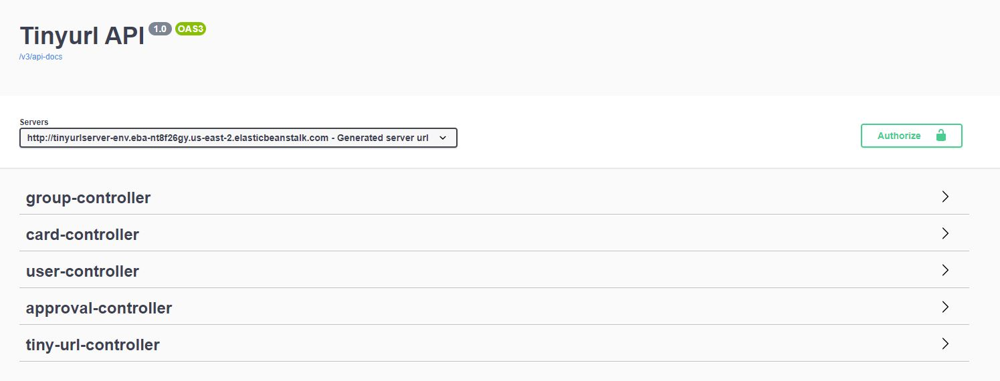
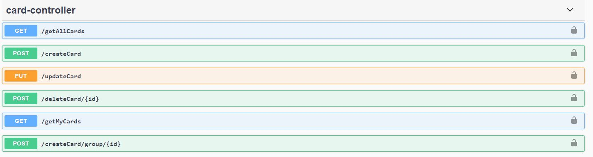
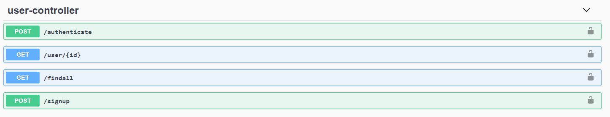
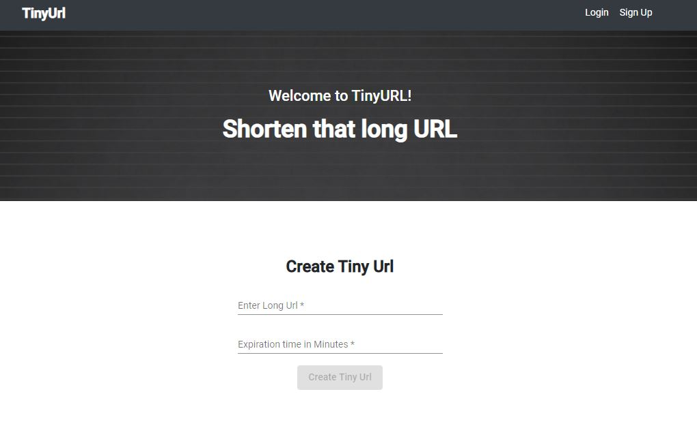

# Tiny Url : Shorten that long url

## CI CD Pipeline

## Database Design

## Swagger

## Application
<h3>Landing Page</h3>

<h3>Create Tiny Url</h3>

<h3>Login Page</h3>

<h3>SignUp Page</h3>

<h3>Home Page</h3>

<h3>MyCards Page</h3>

<h3>Group Page</h3>

<h3>Group Details Page</h3>
<h6>Click on group id for group details</h6>

<h3>Approval Page</h3>

